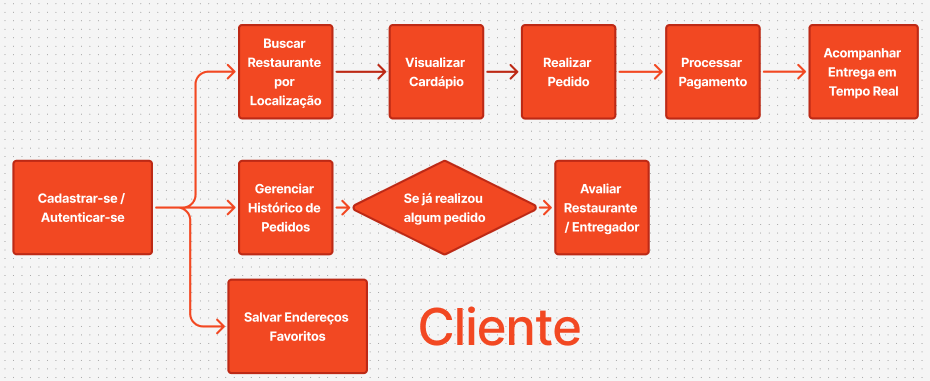
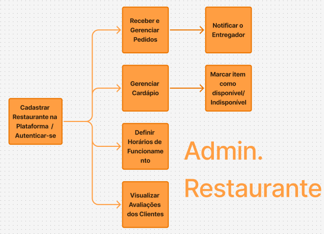
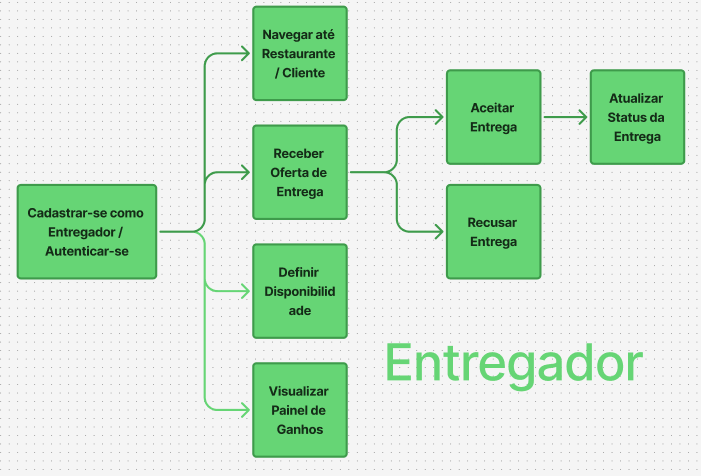
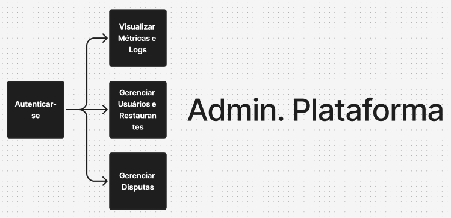
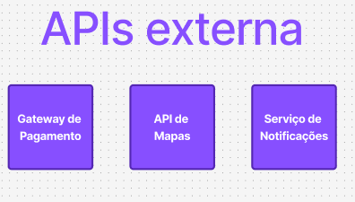

# Requisitos do FoodFlow

**Instituição:** [Centro Universitario SENAC Nações Unidas](https://www.sp.senac.br)  
**Disciplina:** Engenharia de Software  
**Integrantes:**
- Giovanna Paiva Alves
- Matheus Sanchez Duda
- Phelipe Pereira

**Data:** 2026  
**Versão:** 2.0

---

## Sumário

1. [Requisitos Funcionais](#1-requisitos-funcionais)
   - 1.1 [Diagrama de Caso de Uso - Visão Geral](#11-diagrama-de-caso-de-uso--visão-geral)
   - 1.2 [Diagrama de Caso de Uso - Cliente](#12-diagrama-de-caso-de-uso--cliente)
   - 1.3 [Diagrama de Caso de Uso - Restaurante](#13-diagrama-de-caso-de-uso--restaurante)
   - 1.4 [Diagrama de Caso de Uso - Entregador](#14-diagrama-de-caso-de-uso--entregador)
   - 1.5 [Diagrama de Caso de Uso - Admin da Plataforma](#15-diagrama-de-caso-de-uso--admin-da-plataforma)
   - 1.6 [Diagrama de Caso de Uso - APIs Externas](#16-diagrama-de-caso-de-uso--apis-externas)
   - 1.7 [Especificações dos Casos de Uso](#17-especificações-dos-casos-de-uso)
2. [Requisitos Não Funcionais](#2-requisitos-não-funcionais)
3. [Referências](#3-referências)

---

## 1. Requisitos Funcionais

### 1.1 Diagrama de Caso de Uso - Visão Geral

```
Autenticar-se                        ───────────────────────────────────────────────── Cliente
Buscar Restaurante
Realizar Pedido
   | <<include>> ──> Processar Pagamento
Acompanhar Entrega em Tempo Real
Avaliar Restaurante / Entregador
Gerenciar Histórico de Pedidos

Cadastrar e Configurar Restaurante   ──────────────────────────────────────────────── Admin. Restaurante
Gerenciar Cardápio
Marcar Item como Indisponível
Gerenciar Pedidos Recebidos
Configurar Horários de Funcionamento
Visualizar Avaliações

Cadastrar-se como Entregador         ──────────────────────────────────────────────── Entregador
Definir Disponibilidade
Aceitar / Recusar Entrega
Atualizar Status da Entrega
Visualizar Ganhos

Gerenciar Usuários e Restaurantes    ──────────────────────────────────────────────── Admin. Plataforma
Visualizar Métricas e Logs
Gerenciar Disputas

 --- APIs externas ---
Gateway de Pagamento                 ──── Processar Pagamento
API de Mapas                         ──── Acompanhar Entrega em Tempo Real
Serviço de Notificações              ──── Notificar Usuários
```

---

### 1.2 Diagrama de Caso de Uso - Cliente



---

### 1.3 Diagrama de Caso de Uso - Restaurante



---

### 1.4 Diagrama de Caso de Uso - Entregador



---

### 1.5 Diagrama de Caso de Uso - Admin da Plataforma



---

### 1.6 Diagrama de Caso de Uso - APIs Externas



---

### 1.7 Especificações dos Casos de Uso

---

## 1.7.1 Cliente

---

#### UC01: Cadastrar-se / Autenticar-se

| **Campo** | **Descrição** |
|---|---|
| **Requisito ID** | FF-UC-001 |
| **Nome** | Cadastrar-se / Autenticar-se |
| **Descrição** | O cliente deve poder criar uma conta informando nome, e-mail e senha, ou autenticar-se com credenciais existentes para acessar as funcionalidades da plataforma. |
| **Extensões** | Recuperação de senha via e-mail; login com conta Google (futuro). |
| **Critérios de Aceitação** | (a) O sistema deve validar o e-mail e a senha no momento do cadastro. (b) O sistema deve impedir cadastros com e-mails duplicados. (c) A autenticação deve redirecionar o usuário para a tela inicial em até 2 segundos. |
| **Dependências** | Nenhuma, pré-condição para todos os demais casos de uso do cliente. |
| **Fonte** | Cliente (USER-001) |
| **Prioridade** | Alta |

---

#### UC02: Buscar Restaurante por Localização

| **Campo** | **Descrição** |
|---|---|
| **Requisito ID** | FF-UC-002 |
| **Nome** | Buscar Restaurante por Localização |
| **Descrição** | O cliente deve poder buscar restaurantes disponíveis com base em sua localização atual ou em um endereço informado manualmente, podendo filtrar por tipo de culinária. |
| **Extensões** | Filtrar por avaliação mínima; ordenar por tempo de entrega estimado; ordenar por taxa de entrega. |
| **Critérios de Aceitação** | (a) O sistema deve exibir restaurantes em um raio configurável a partir da localização do cliente. (b) Restaurantes fora do horário de funcionamento devem aparecer como indisponíveis. (c) A listagem deve carregar em até 3 segundos. |
| **Dependências** | FF-UC-001 (autenticação); Integração com API de Mapas. |
| **Fonte** | Cliente (USER-001) |
| **Prioridade** | Alta |

---

#### UC03: Visualizar Cardápio

| **Campo** | **Descrição** |
|---|---|
| **Requisito ID** | FF-UC-003 |
| **Nome** | Visualizar Cardápio |
| **Descrição** | O cliente deve poder visualizar o cardápio completo de um restaurante selecionado, com nome dos itens, descrição, preço e imagem (quando disponível). Itens indisponíveis devem estar claramente marcados. |
| **Extensões** | Filtragem por categoria (ex.: entradas, pratos principais, bebidas); busca de item por nome. |
| **Critérios de Aceitação** | (a) O cardápio deve refletir a versão mais atualizada cadastrada pelo restaurante. (b) Itens marcados como indisponíveis não devem permitir adição ao carrinho. |
| **Dependências** | FF-UC-002; FF-UC-011 (gerenciamento de cardápio pelo restaurante). |
| **Fonte** | Cliente (USER-001); Administrador do Restaurante (USER-002) |
| **Prioridade** | Alta |

---

#### UC04: Realizar Pedido

| **Campo** | **Descrição** |
|---|---|
| **Requisito ID** | FF-UC-004 |
| **Nome** | Realizar Pedido |
| **Descrição** | O cliente deve poder selecionar itens do cardápio, adicioná-los ao carrinho, revisar o pedido e confirmar. O sistema deve calcular automaticamente o subtotal, a taxa de entrega e o total. |
| **Extensões** | Adicionar observações por item (ex.: "sem cebola"); inserir cupom de desconto. |
| **Critérios de Aceitação** | (a) O carrinho deve atualizar os valores em tempo real a cada item adicionado ou removido. (b) Não deve ser possível confirmar um pedido com carrinho vazio. (c) O sistema deve exibir o tempo estimado de entrega antes da confirmação. |
| **Dependências** | FF-UC-003 (visualizar cardápio); FF-UC-005 (processar pagamento). |
| **Fonte** | Cliente (USER-001) |
| **Prioridade** | Alta |

---

#### UC05: Processar Pagamento

| **Campo** | **Descrição** |
|---|---|
| **Requisito ID** | FF-UC-005 |
| **Nome** | Processar Pagamento |
| **Descrição** | O sistema deve integrar-se a um gateway de pagamento externo para processar o pagamento do pedido, suportando cartão de crédito, débito e PIX. O sistema não deve armazenar dados do cartão diretamente. |
| **Extensões** | Salvar forma de pagamento para uso futuro (tokenização via gateway); pagamento em dinheiro na entrega. |
| **Critérios de Aceitação** | (a) O pagamento deve ser confirmado ou recusado pelo gateway em até 5 segundos. (b) Em caso de falha no pagamento, o pedido não deve ser criado. (c) Dados do cartão não devem ser armazenados nos servidores do FoodFlow. |
| **Dependências** | FF-UC-004; Integração com Gateway de Pagamento. |
| **Fonte** | Cliente (USER-001) |
| **Prioridade** | Alta |

---

#### UC06: Acompanhar Entrega em Tempo Real

| **Campo** | **Descrição** |
|---|---|
| **Requisito ID** | FF-UC-006 |
| **Nome** | Acompanhar Entrega em Tempo Real |
| **Descrição** | Após a confirmação do pedido, o cliente deve poder visualizar o status atual do pedido (confirmado, em preparo, coletado, em trânsito, entregue) e a localização em tempo real do entregador no mapa. |
| **Extensões** | Notificação push a cada mudança de status; contato via chat anonimizado com entregador. |
| **Critérios de Aceitação** | (a) A posição do entregador deve ser atualizada a cada 15 segundos no mapa. (b) As mudanças de status do pedido devem ser exibidas em tempo real, sem necessidade de recarregar a página. |
| **Dependências** | FF-UC-004; FF-UC-022 (atualização de status pelo entregador); API de Mapas. |
| **Fonte** | Cliente (USER-001) |
| **Prioridade** | Alta |

---

#### UC07: Avaliar Restaurante e Entregador

| **Campo** | **Descrição** |
|---|---|
| **Requisito ID** | FF-UC-007 |
| **Nome** | Avaliar Restaurante e Entregador |
| **Descrição** | Após a conclusão da entrega, o cliente deve poder atribuir uma nota (1 a 5 estrelas) e um comentário opcional tanto ao restaurante quanto ao entregador. |
| **Extensões** | Denúncia de comportamento inadequado pelo entregador; resposta do restaurante ao comentário (futuro). |
| **Critérios de Aceitação** | (a) A avaliação só deve ser possível após o status do pedido ser "Entregue". (b) Cada pedido permite apenas uma avaliação por ator. (c) A nota média do restaurante deve ser atualizada imediatamente após a submissão. |
| **Dependências** | FF-UC-006 (pedido concluído). |
| **Fonte** | Cliente (USER-001) |
| **Prioridade** | Média |

---

#### UC08: Gerenciar Histórico de Pedidos

| **Campo** | **Descrição** |
|---|---|
| **Requisito ID** | FF-UC-008 |
| **Nome** | Gerenciar Histórico de Pedidos |
| **Descrição** | O cliente deve poder visualizar todos os pedidos realizados anteriormente, com detalhes como itens, valores, data, status final e restaurante. Deve ser possível repetir um pedido anterior com um clique. |
| **Extensões** | Filtrar histórico por período ou restaurante; exportar comprovante de pedido em PDF. |
| **Critérios de Aceitação** | (a) O histórico deve exibir todos os pedidos dos últimos 12 meses. (b) A opção de repetir pedido deve pré-preencher o carrinho com os mesmos itens do pedido original, desconsiderando itens indisponíveis. (c) O histórico deve carregar em até 2 segundos. |
| **Dependências** | FF-UC-004 (pedidos realizados); FF-UC-001 (autenticação). |
| **Fonte** | Cliente (USER-001) |
| **Prioridade** | Média |

---

## 1.7.2 Administrador do Restaurante

---

#### UC10: Cadastrar e Configurar Restaurante

| **Campo** | **Descrição** |
|---|---|
| **Requisito ID** | FF-UC-010 |
| **Nome** | Cadastrar e Configurar Restaurante |
| **Descrição** | O administrador do restaurante deve poder criar o perfil do estabelecimento na plataforma, informando nome, endereço, CNPJ, tipo de culinária, logo, fotos e dados bancários para recebimento. |
| **Extensões** | Editar dados do perfil a qualquer momento; desativar temporariamente o restaurante na plataforma. |
| **Critérios de Aceitação** | (a) O cadastro só deve ser concluído após validação do CNPJ. (b) O restaurante recém-cadastrado deve ficar em análise pela equipe da plataforma por até 48 horas antes de se tornar visível. (c) Dados bancários devem ser armazenados de forma criptografada. |
| **Dependências** | Nenhuma, pré-condição para todos os demais casos de uso do restaurante. |
| **Fonte** | Administrador do Restaurante (USER-002) |
| **Prioridade** | Alta |

---

#### UC11: Gerenciar Cardápio

| **Campo** | **Descrição** |
|---|---|
| **Requisito ID** | FF-UC-011 |
| **Nome** | Gerenciar Cardápio |
| **Descrição** | O administrador do restaurante deve poder criar, editar, excluir e reordenar itens do cardápio, definindo nome, descrição, preço, categoria e disponibilidade de cada item. |
| **Extensões** | Marcar item como indisponível temporariamente sem excluí-lo (FF-UC-012); duplicar item para criação rápida. |
| **Critérios de Aceitação** | (a) Alterações no cardápio devem ser refletidas na visão do cliente em até 30 segundos. (b) Não deve ser possível salvar um item sem nome e preço. (c) Itens excluídos não devem aparecer em novos pedidos, mas devem ser mantidos no histórico de pedidos anteriores. |
| **Dependências** | FF-UC-010 (restaurante cadastrado). |
| **Fonte** | Administrador do Restaurante (USER-002) |
| **Prioridade** | Alta |

---

#### UC12: Marcar Item como Indisponível

| **Campo** | **Descrição** |
|---|---|
| **Requisito ID** | FF-UC-012 |
| **Nome** | Marcar Item como Indisponível |
| **Descrição** | O administrador do restaurante deve poder marcar um item do cardápio como temporariamente indisponível sem precisar excluí-lo, tornando-o visível ao cliente porém bloqueado para adição ao carrinho. |
| **Extensões** | Programar reativação automática do item em data e horário futuros. |
| **Critérios de Aceitação** | (a) A mudança de disponibilidade deve ser refletida para o cliente em até 30 segundos. (b) O item indisponível deve ser exibido com indicação visual clara. (c) O administrador deve poder reverter o estado de volta a disponível a qualquer momento. |
| **Dependências** | FF-UC-011 (gerenciamento de cardápio). |
| **Fonte** | Administrador do Restaurante (USER-002) |
| **Prioridade** | Alta |

---

#### UC13: Configurar Horários de Funcionamento

| **Campo** | **Descrição** |
|---|---|
| **Requisito ID** | FF-UC-013 |
| **Nome** | Configurar Horários de Funcionamento |
| **Descrição** | O administrador do restaurante deve poder definir os horários de abertura e fechamento para cada dia da semana, bem como configurar exceções para feriados ou eventos especiais. |
| **Extensões** | Configurar pausas intermediárias (ex.: das 15h às 17h); ativar modo "fechado temporariamente" com prazo de reabertura. |
| **Critérios de Aceitação** | (a) Fora do horário configurado, o restaurante deve aparecer automaticamente como fechado na listagem de clientes. (b) Alterações de horário devem entrar em vigor imediatamente após salvar. |
| **Dependências** | FF-UC-010 (restaurante cadastrado). |
| **Fonte** | Administrador do Restaurante (USER-002) |
| **Prioridade** | Alta |

---

#### UC14: Receber e Gerenciar Pedidos

| **Campo** | **Descrição** |
|---|---|
| **Requisito ID** | FF-UC-014 |
| **Nome** | Receber e Gerenciar Pedidos |
| **Descrição** | O administrador do restaurante deve receber notificação imediata de novos pedidos e poder confirmar ou recusar cada pedido dentro de um tempo limite. Pedidos confirmados devem iniciar automaticamente o fluxo de busca por entregador. |
| **Extensões** | Definir tempo estimado de preparo por pedido; cancelar pedido já confirmado com justificativa. |
| **Critérios de Aceitação** | (a) A notificação de novo pedido deve chegar em até 10 segundos após a confirmação do pagamento. (b) Se o restaurante não responder em 3 minutos, o sistema deve cancelar o pedido e notificar o cliente. (c) Ao confirmar, o sistema deve disparar automaticamente a busca por entregador disponível. |
| **Dependências** | FF-UC-005 (pagamento aprovado); FF-UC-019 (oferta de entrega ao entregador). |
| **Fonte** | Administrador do Restaurante (USER-002) |
| **Prioridade** | Alta |

---

#### UC15: Visualizar Avaliações

| **Campo** | **Descrição** |
|---|---|
| **Requisito ID** | FF-UC-015 |
| **Nome** | Visualizar Avaliações |
| **Descrição** | O administrador do restaurante deve poder visualizar todas as avaliações recebidas pelos clientes, incluindo nota, comentário, data e pedido associado, além de acompanhar a evolução da nota média ao longo do tempo. |
| **Extensões** | Responder publicamente a avaliações de clientes (futuro); denunciar avaliações impróprias para análise da plataforma. |
| **Critérios de Aceitação** | (a) As avaliações devem ser exibidas em ordem cronológica decrescente. (b) A nota média deve ser recalculada e exibida em tempo real após nova avaliação. (c) O sistema deve permitir filtrar avaliações por período e por faixa de nota. |
| **Dependências** | FF-UC-007 (avaliação realizada pelo cliente). |
| **Fonte** | Administrador do Restaurante (USER-002) |
| **Prioridade** | Média |

---

## 1.7.3 Entregador

---

#### UC16: Cadastrar-se como Entregador

| **Campo** | **Descrição** |
|---|---|
| **Requisito ID** | FF-UC-016 |
| **Nome** | Cadastrar-se como Entregador |
| **Descrição** | O entregador deve poder criar uma conta na plataforma informando dados pessoais (nome, CPF, telefone), dados do veículo (tipo, placa) e documentos obrigatórios (CNH, comprovante de residência) para análise. |
| **Extensões** | Atualizar dados do veículo após aprovação; reenviar documentação reprovada. |
| **Critérios de Aceitação** | (a) O cadastro deve exigir o envio de foto legível de todos os documentos obrigatórios. (b) A análise da documentação deve ser concluída em até 3 dias úteis. (c) O entregador deve ser notificado por e-mail e push sobre aprovação ou reprovação do cadastro. |
| **Dependências** | Nenhuma, pré-condição para todos os demais casos de uso do entregador. |
| **Fonte** | Entregador (USER-003) |
| **Prioridade** | Alta |

---

#### UC17: Autenticar-se como Entregador

| **Campo** | **Descrição** |
|---|---|
| **Requisito ID** | FF-UC-017 |
| **Nome** | Autenticar-se como Entregador |
| **Descrição** | O entregador deve poder fazer login na aplicação mobile com e-mail e senha cadastrados para acessar as funcionalidades de entrega. |
| **Extensões** | Recuperação de senha via e-mail; bloqueio de acesso em caso de suspeita de conta comprometida. |
| **Critérios de Aceitação** | (a) O login deve ser concluído em até 2 segundos em condições normais. (b) Após 5 tentativas falhas, a conta deve ser bloqueada por 15 minutos. (c) O token de sessão do entregador deve expirar em 24 horas. |
| **Dependências** | FF-UC-016 (cadastro aprovado). |
| **Fonte** | Entregador (USER-003) |
| **Prioridade** | Alta |

---

#### UC18: Definir Disponibilidade

| **Campo** | **Descrição** |
|---|---|
| **Requisito ID** | FF-UC-018 |
| **Nome** | Definir Disponibilidade |
| **Descrição** | O entregador deve poder ativar ou desativar sua disponibilidade para receber ofertas de entrega a qualquer momento pelo aplicativo. Quando disponível, o sistema deve monitorar sua localização GPS. |
| **Extensões** | Definir pausa programada com retorno automático; indicar motivo da indisponibilidade (almoço, fim de expediente). |
| **Critérios de Aceitação** | (a) A mudança de status deve ser processada em até 3 segundos. (b) Ao ficar disponível, o sistema deve iniciar o monitoramento GPS imediatamente. (c) Ao ficar indisponível, nenhuma nova oferta deve ser enviada e o GPS deve ser desativado. (d) Ação só poderá ser feita, caso o entregador não esteja com um pedido em andamento. |
| **Dependências** | FF-UC-017 (autenticação do entregador). |
| **Fonte** | Entregador (USER-003) |
| **Prioridade** | Alta |

---

#### UC19: Receber Oferta de Entrega

| **Campo** | **Descrição** |
|---|---|
| **Requisito ID** | FF-UC-019 |
| **Nome** | Receber Oferta de Entrega |
| **Descrição** | O entregador deve receber uma notificação com os detalhes da entrega disponível (restaurante, endereço de entrega, valor da corrida, distância estimada) e decidir entre aceitar ou recusar. |
| **Extensões** | Recusar entrega (FF-UC-021) sem penalidade até um limite de recusas consecutivas. |
| **Critérios de Aceitação** | (a) A oferta deve expirar em 30 segundos caso o entregador não responda, sendo repassada ao próximo entregador disponível. (b) O sistema deve priorizar entregadores mais próximos ao restaurante. |
| **Dependências** | FF-UC-018 (entregador disponível); FF-UC-014 (pedido confirmado pelo restaurante). |
| **Fonte** | Entregador (USER-003) |
| **Prioridade** | Alta |

---

#### UC20: Aceitar Entrega

| **Campo** | **Descrição** |
|---|---|
| **Requisito ID** | FF-UC-020 |
| **Nome** | Aceitar Entrega |
| **Descrição** | Ao aceitar uma oferta de entrega, o entregador deve ser direcionado automaticamente à tela de navegação com rota até o restaurante, e o cliente e o restaurante devem ser notificados da aceitação. |
| **Extensões** | Visualizar rota alternativa em caso de trânsito; contato via chat anonimizado com o restaurante. |
| **Critérios de Aceitação** | (a) A aceitação deve ser processada em até 3 segundos e bloquear a oferta para outros entregadores. (b) O mapa com rota até o restaurante deve ser exibido imediatamente após a aceitação. (c) O cliente deve receber notificação de confirmação em até 10 segundos. |
| **Dependências** | FF-UC-019 (oferta recebida); API de Mapas. |
| **Fonte** | Entregador (USER-003) |
| **Prioridade** | Alta |

---

#### UC21: Recusar Entrega

| **Campo** | **Descrição** |
|---|---|
| **Requisito ID** | FF-UC-021 |
| **Nome** | Recusar Entrega |
| **Descrição** | O entregador deve poder recusar uma oferta de entrega antes do prazo de 30 segundos expirar. A oferta deve ser repassada imediatamente ao próximo entregador disponível. |
| **Extensões** | Informar motivo da recusa (distância, rota, valor); penalidade por excesso de recusas consecutivas. |
| **Critérios de Aceitação** | (a) A recusa deve ser registrada com timestamp. (b) Após 5 recusas consecutivas sem aceitar nenhuma entrega, o sistema deve notificar o entregador sobre possível impacto no ranking. (c) A oferta deve ser repassada imediatamente ao próximo entregador disponível. |
| **Dependências** | FF-UC-019 (oferta recebida). |
| **Fonte** | Entregador (USER-003) |
| **Prioridade** | Média |

---

#### UC22: Atualizar Status da Entrega

| **Campo** | **Descrição** |
|---|---|
| **Requisito ID** | FF-UC-022 |
| **Nome** | Atualizar Status da Entrega |
| **Descrição** | O entregador deve poder atualizar manualmente o status da entrega conforme o fluxo: "A caminho do restaurante" → "Pedido coletado" → "A caminho do cliente" → "Entrega concluída". |
| **Extensões** | Reportar problema na entrega (endereço não encontrado, cliente ausente); tirar foto como comprovante de entrega. |
| **Critérios de Aceitação** | (a) Cada atualização de status deve ser registrada com timestamp e posição GPS. (b) A mudança de status deve ser refletida na tela do cliente em até 5 segundos. (c) O status "Entrega concluída" deve ser irreversível e acionar o pagamento ao entregador. |
| **Dependências** | FF-UC-020 (entrega aceita); FF-UC-006 (acompanhamento pelo cliente). |
| **Fonte** | Entregador (USER-003) |
| **Prioridade** | Alta |

---

#### UC23: Visualizar Ganhos

| **Campo** | **Descrição** |
|---|---|
| **Requisito ID** | FF-UC-023 |
| **Nome** | Visualizar Ganhos |
| **Descrição** | O entregador deve poder visualizar um painel com o resumo dos seus ganhos, incluindo valor por entrega, bônus, total diário, semanal e mensal, além do histórico de entregas realizadas. |
| **Extensões** | Solicitar antecipação de saldo; exportar relatório de ganhos para declaração de renda. |
| **Critérios de Aceitação** | (a) O painel de ganhos deve ser atualizado em tempo real após cada entrega concluída. (b) O entregador deve poder filtrar o histórico por data e visualizar detalhes de cada corrida. (c) O valor mínimo para saque deve ser exibido claramente. |
| **Dependências** | FF-UC-022 (entrega concluída). |
| **Fonte** | Entregador (USER-003) |
| **Prioridade** | Média |

---

## 1.7.4 Administrador da Plataforma

---

#### UC30: Autenticar-se como Administrador da Plataforma

| **Campo** | **Descrição** |
|---|---|
| **Requisito ID** | FF-UC-030 |
| **Nome** | Autenticar-se como Administrador da Plataforma |
| **Descrição** | O administrador da plataforma deve poder autenticar-se em um painel administrativo seguro com e-mail, senha e autenticação de dois fatores (2FA) para acessar funcionalidades de gestão global. |
| **Extensões** | Revogar sessões ativas remotamente; login via SSO corporativo (futuro). |
| **Critérios de Aceitação** | (a) O 2FA deve ser obrigatório para todos os administradores da plataforma. (b) Sessões inativas por mais de 30 minutos devem ser encerradas automaticamente. (c) Tentativas de acesso não autorizado devem gerar alerta imediato à equipe de segurança. |
| **Dependências** | Nenhuma. |
| **Fonte** | Administrador da Plataforma (USER-004) |
| **Prioridade** | Alta |

---

#### UC31: Gerenciar Usuários

| **Campo** | **Descrição** |
|---|---|
| **Requisito ID** | FF-UC-031 |
| **Nome** | Gerenciar Usuários |
| **Descrição** | O administrador da plataforma deve poder visualizar, buscar, suspender, reativar e excluir contas de clientes, entregadores e administradores de restaurantes, além de redefinir senhas por solicitação. |
| **Extensões** | Exportar lista de usuários por perfil; visualizar histórico de ações de um usuário. |
| **Critérios de Aceitação** | (a) A busca de usuários deve retornar resultados em até 2 segundos. (b) A suspensão de um usuário deve bloquear seu acesso imediatamente. (c) A exclusão de conta deve anonimizar os dados pessoais conforme a LGPD, mantendo registros transacionais anonimizados. |
| **Dependências** | FF-UC-030 (autenticação do administrador). |
| **Fonte** | Administrador da Plataforma (USER-004) |
| **Prioridade** | Alta |

---

#### UC32: Gerenciar Restaurantes

| **Campo** | **Descrição** |
|---|---|
| **Requisito ID** | FF-UC-032 |
| **Nome** | Gerenciar Restaurantes |
| **Descrição** | O administrador da plataforma deve poder aprovar, suspender ou remover restaurantes cadastrados, além de visualizar e editar seus dados cadastrais e histórico de pedidos para fins de auditoria. |
| **Extensões** | Adicionar nota interna ao perfil do restaurante; enviar comunicado direto ao administrador do restaurante. |
| **Critérios de Aceitação** | (a) A aprovação de um novo restaurante deve torná-lo visível na plataforma em até 5 minutos. (b) A suspensão de um restaurante deve ocultá-lo imediatamente da listagem de clientes. (c) O histórico de pedidos do restaurante deve ser acessível para auditorias. |
| **Dependências** | FF-UC-030; FF-UC-010 (restaurante cadastrado). |
| **Fonte** | Administrador da Plataforma (USER-004) |
| **Prioridade** | Alta |

---

#### UC33: Visualizar Métricas e Logs

| **Campo** | **Descrição** |
|---|---|
| **Requisito ID** | FF-UC-033 |
| **Nome** | Visualizar Métricas e Logs |
| **Descrição** | O administrador da plataforma deve ter acesso a um painel com métricas operacionais em tempo real, como número de pedidos ativos, tempo médio de entrega, taxa de cancelamento, receita do período e logs de erros do sistema. |
| **Extensões** | Exportar relatórios em CSV/PDF; configurar alertas automáticos para métricas críticas. |
| **Critérios de Aceitação** | (a) O painel de métricas deve ser atualizado a cada 60 segundos automaticamente. (b) Os logs de sistema devem ser retidos por no mínimo 90 dias. (c) O administrador deve poder filtrar métricas por cidade, período e categoria. |
| **Dependências** | FF-UC-030 (autenticação do administrador). |
| **Fonte** | Administrador da Plataforma (USER-004) |
| **Prioridade** | Alta |

---

#### UC34: Gerenciar Disputas

| **Campo** | **Descrição** |
|---|---|
| **Requisito ID** | FF-UC-034 |
| **Nome** | Gerenciar Disputas |
| **Descrição** | O administrador da plataforma deve poder visualizar, analisar e resolver disputas abertas por clientes ou restaurantes, como pedidos não entregues, cobranças incorretas ou avaliações contestadas. |
| **Extensões** | Emitir reembolso parcial ou total ao cliente; aplicar advertência ou suspensão ao ator responsável. |
| **Critérios de Aceitação** | (a) Novas disputas devem gerar alerta automático para a equipe de suporte. (b) O prazo máximo para resolução de uma disputa deve ser de 5 dias úteis, com atualização de status ao solicitante. (c) O sistema deve registrar o histórico completo de cada disputa, incluindo evidências e decisão tomada. |
| **Dependências** | FF-UC-030; FF-UC-007 (avaliação); FF-UC-004 (pedido). |
| **Fonte** | Administrador da Plataforma (USER-004) |
| **Prioridade** | Alta |

---

## 2. Requisitos Não Funcionais

---

#### NF-FF-001: Tempo de Resposta

| **Campo** | **Descrição** |
|---|---|
| **Requisito ID** | NF-FF-001 |
| **Título** | Tempo de Resposta |
| **Descrição** | O sistema deve responder a todas as solicitações dos usuários em até 2 segundos em condições normais de uso e em até 4 segundos nos horários de pico. |
| **Entrada** | Qualquer solicitação do usuário (busca de restaurantes, carregamento de cardápio, confirmação de pedido, atualização de status). |
| **Processamento** | O sistema processa a solicitação, consulta o banco de dados e/ou serviços externos e retorna o resultado ao cliente. |
| **Saída** | Resposta renderizada na interface do usuário (listagem, confirmação, atualização). |
| **Restrições** | Aplica-se a todas as rotas da API pública. Operações de terceiros (gateway de pagamento, API de mapas) estão sujeitas aos SLAs dos respectivos fornecedores. |
| **Critérios de Aceitação** | (a) 95% das requisições devem ser atendidas em até 2 segundos em carga normal. (b) Em testes de carga simulando horário de pico, o percentil 99 não deve exceder 4 segundos. (c) A experiência do usuário não deve ser prejudicada por lentidão perceptível. |

---

#### NF-FF-002: Disponibilidade e Uptime

| **Campo** | **Descrição** |
|---|---|
| **Requisito ID** | NF-FF-002 |
| **Título** | Disponibilidade e Uptime |
| **Descrição** | O sistema deve estar disponível 99,5% do tempo mensal, com janelas de manutenção programadas fora dos horários de pico (almoço: 11h–14h / jantar: 18h–21h). |
| **Entrada** | Qualquer tentativa de acesso à plataforma por qualquer ator. |
| **Processamento** | O servidor processa a requisição e entrega a resposta. |
| **Saída** | Interface funcional ou mensagem de manutenção programada clara ao usuário. |
| **Restrições** | Manutenções emergenciais podem ocorrer fora da janela programada, mas devem ser comunicadas aos parceiros com antecedência mínima de 1 hora. |
| **Critérios de Aceitação** | (a) O sistema não deve ficar indisponível mais de 3,6 horas por mês. (b) Falhas inesperadas devem acionar alertas automáticos à equipe de operações. (c) Nenhuma manutenção programada deve ocorrer entre 11h e 22h. |

---

#### NF-FF-003: Escalabilidade e Capacidade

| **Campo** | **Descrição** |
|---|---|
| **Requisito ID** | NF-FF-003 |
| **Título** | Escalabilidade e Capacidade |
| **Descrição** | O sistema deve suportar entre 2.000 e 10.000 usuários ativos mensais na fase inicial, com capacidade de escalar horizontalmente para até 50.000 usuários sem redesenho arquitetural. |
| **Entrada** | Acessos simultâneos de clientes, entregadores e administradores de restaurantes, especialmente nos horários de pico. |
| **Processamento** | O sistema deve distribuir a carga entre instâncias e realizar auto-scaling conforme demanda. |
| **Saída** | Tempo de resposta dentro dos limites do NF-FF-001 mesmo em carga elevada. |
| **Restrições** | Estimativa de 20.000 pedidos processados no primeiro ano. Picos esperados de 500 pedidos/hora nos horários de almoço e jantar. |
| **Critérios de Aceitação** | (a) Testes de carga devem simular 500 usuários simultâneos sem degradação de desempenho. (b) A arquitetura deve permitir adição de instâncias sem downtime (zero-downtime deploy). (c) O banco de dados deve suportar ao menos 10.000 transações por hora. |

---

#### NF-FF-004: Segurança e Controle de Acesso

| **Campo** | **Descrição** |
|---|---|
| **Requisito ID** | NF-FF-004 |
| **Título** | Segurança e Controle de Acesso |
| **Descrição** | O sistema deve garantir que cada ator acesse somente os recursos autorizados ao seu perfil, utilizando autenticação baseada em tokens (JWT) e comunicação criptografada via HTTPS/TLS. |
| **Entrada** | Credenciais de login (e-mail e senha) ou token de sessão válido em requisições autenticadas. |
| **Processamento** | O sistema valida as credenciais, emite um token JWT com tempo de expiração e aplica controle de acesso baseado em papéis (RBAC) em todas as rotas protegidas. |
| **Saída** | Acesso concedido ou negado com mensagem de erro padronizada (HTTP 401/403). |
| **Restrições** | Senhas devem ser armazenadas com hash (bcrypt, mínimo custo 12). Dados de cartão não devem ser persistidos nos servidores do FoodFlow. Tokens JWT devem expirar em 24 horas. |
| **Critérios de Aceitação** | (a) Um cliente não deve conseguir acessar endpoints de administração de restaurante. (b) Todas as requisições à API devem trafegar exclusivamente via HTTPS. (c) Tentativas de brute-force devem ser bloqueadas após 5 tentativas falhas consecutivas (bloqueio de 15 minutos). |

---

#### NF-FF-005: Conformidade com a LGPD

| **Campo** | **Descrição** |
|---|---|
| **Requisito ID** | NF-FF-005 |
| **Título** | Conformidade com a LGPD (Lei nº 13.709/2018) |
| **Descrição** | O sistema deve coletar, armazenar e processar dados pessoais de acordo com os princípios da Lei Geral de Proteção de Dados, garantindo consentimento, finalidade e minimização de dados. |
| **Entrada** | Dados pessoais fornecidos pelos usuários no momento do cadastro e durante o uso da plataforma (nome, e-mail, CPF, endereço, localização GPS). |
| **Processamento** | O sistema deve registrar o consentimento explícito do usuário e permitir que ele solicite a exclusão ou portabilidade dos seus dados. |
| **Saída** | Confirmação de consentimento registrado; relatório de dados pessoais disponível para exportação pelo usuário. |
| **Restrições** | Dados de localização GPS do entregador devem ser utilizados exclusivamente para o rastreamento ativo de entregas e descartados após a conclusão. Nenhum dado pessoal pode ser compartilhado com terceiros sem consentimento. |
| **Critérios de Aceitação** | (a) O fluxo de cadastro deve exibir e exigir aceite da Política de Privacidade. (b) O usuário deve poder solicitar exclusão de conta e dados a qualquer momento. (c) A plataforma não deve armazenar dados de localização após a conclusão do pedido. |

---

#### NF-FF-006: Usabilidade e Acessibilidade

| **Campo** | **Descrição** |
|---|---|
| **Requisito ID** | NF-FF-006 |
| **Título** | Usabilidade e Acessibilidade |
| **Descrição** | A interface deve ser intuitiva o suficiente para que um novo usuário consiga concluir um pedido pela primeira vez sem assistência, em até 4 minutos, em dispositivos móveis (iOS e Android) e navegadores web modernos. |
| **Entrada** | Interação do usuário com a interface (toques, cliques, digitação). |
| **Processamento** | O sistema responde às ações do usuário com feedback visual imediato (loading states, mensagens de sucesso/erro). |
| **Saída** | Fluxo de pedido concluído com confirmação clara ao usuário. |
| **Restrições** | O design responsivo deve suportar telas a partir de 320px de largura. O contraste das cores deve atender ao nível AA das diretrizes WCAG 2.1. |
| **Critérios de Aceitação** | (a) Teste de usabilidade com 5 usuários novatos deve demonstrar conclusão do primeiro pedido em até 4 minutos. (b) A interface deve ser funcional nos navegadores Chrome, Firefox e Safari (últimas 2 versões). (c) O app mobile deve ser compatível com Android 10+ e iOS 14+. |

---

#### NF-FF-007: Rastreamento em Tempo Real do Entregador

| **Campo** | **Descrição** |
|---|---|
| **Requisito ID** | NF-FF-007 |
| **Título** | Rastreamento em Tempo Real do Entregador |
| **Descrição** | O sistema deve atualizar a posição do entregador no mapa exibido ao cliente a cada 15 segundos durante o fluxo de entrega ativa, utilizando WebSockets ou tecnologia equivalente. |
| **Entrada** | Coordenadas GPS enviadas pelo dispositivo do entregador durante a entrega. |
| **Processamento** | O servidor recebe as coordenadas, atualiza o estado da entrega e transmite em tempo real para o cliente conectado via canal persistente (WebSocket). |
| **Saída** | Marcador de posição atualizado no mapa da tela de acompanhamento do cliente. |
| **Restrições** | A atualização de posição não deve consumir mais de 5% de bateria do dispositivo do entregador por hora. Dados de localização só devem ser transmitidos durante entregas ativas. |
| **Critérios de Aceitação** | (a) A posição do entregador deve ser atualizada com atraso máximo de 20 segundos na interface do cliente. (b) Em caso de perda de sinal do entregador, o sistema deve exibir a última posição conhecida com indicação de tempo. (c) A conexão WebSocket deve ser restabelecida automaticamente em até 5 segundos após queda. |

---

#### NF-FF-008: Compatibilidade de Plataforma

| **Campo** | **Descrição** |
|---|---|
| **Requisito ID** | NF-FF-008 |
| **Título** | Compatibilidade de Plataforma (Web e Mobile) |
| **Descrição** | O FoodFlow deve disponibilizar experiências otimizadas tanto para navegadores web modernos quanto para dispositivos móveis, garantindo consistência funcional entre as plataformas. |
| **Entrada** | Acesso à plataforma via navegador desktop/mobile ou aplicativo nativo (Android/iOS). |
| **Processamento** | O sistema detecta o tipo de dispositivo e serve a interface adequada (responsiva no web; nativa no mobile). |
| **Saída** | Interface funcional e otimizada para o dispositivo utilizado. |
| **Restrições** | Funcionalidades de GPS e notificações push têm dependência de permissões do sistema operacional do dispositivo. O app mobile deve pesar menos de 30 MB no download inicial. |
| **Critérios de Aceitação** | (a) Todas as funcionalidades críticas (pedido, pagamento, rastreamento) devem funcionar tanto no web quanto no mobile. (b) O app deve passar na revisão das lojas Google Play e Apple App Store. (c) A versão web deve ser totalmente funcional sem instalação de plugins adicionais. |

---

#### NF-FF-009: Sistema de Notificações

| **Campo** | **Descrição** |
|---|---|
| **Requisito ID** | NF-FF-009 |
| **Título** | Sistema de Notificações |
| **Descrição** | O sistema deve enviar notificações em tempo real para clientes, restaurantes e entregadores em resposta a eventos relevantes, utilizando notificações push (mobile), in-app e e-mail como canais de comunicação. |
| **Entrada** | Eventos do sistema: novo pedido, pedido confirmado, entregador a caminho, entrega concluída, nova oferta de corrida. |
| **Processamento** | O serviço de notificações (ex.: Firebase Cloud Messaging) recebe o evento e despacha a mensagem para os dispositivos registrados dos atores relevantes. |
| **Saída** | Notificação recebida no dispositivo do destinatário em até 10 segundos após o evento. |
| **Restrições** | O usuário deve poder configurar quais notificações deseja receber. Notificações de marketing devem respeitar o horário preferencial do usuário. |
| **Critérios de Aceitação** | (a) Notificações críticas (novo pedido para restaurante, entrega aceita para cliente) devem ser entregues em até 10 segundos. (b) O sistema deve registrar log de todas as notificações enviadas com status de entrega. (c) O usuário deve conseguir desativar notificações não críticas sem perder as operacionais. |

---

## 3. Referências

[1] IEEE Std 830-1998. **IEEE Recommended Practice for Software Requirements Specifications**. Institute of Electrical and Electronics Engineers, 1998.

[2] ISO/IEC/IEEE 29148:2011. **Systems and software engineering – Life cycle processes – Requirements engineering**. International Organization for Standardization, 2011.

[3] ABNT NBR ISO/IEC 9126-1:2003. **Engenharia de software – Qualidade de produto**. Associação Brasileira de Normas Técnicas, 2003.

[4] BRASIL. **Lei nº 13.709, de 14 de agosto de 2018 – Lei Geral de Proteção de Dados Pessoais (LGPD)**. Disponível em: https://www.planalto.gov.br/ccivil_03/_ato2015-2018/2018/lei/l13709.htm. Acesso em: abril de 2026.

[5] PRESSMAN, R. S.; MAXIM, B. R. **Engenharia de Software: Uma Abordagem Profissional**. 8. ed. Porto Alegre: AMGH, 2016.

[6] SOMMERVILLE, I. **Engenharia de Software**. 10. ed. São Paulo: Pearson, 2019.

[7] W3C. **Web Content Accessibility Guidelines (WCAG) 2.1**. Disponível em: https://www.w3.org/TR/WCAG21/. Acesso em: abril de 2026.
