# Seção 1 — Diagrama de Classes

> **Trabalho 3 — FoodFlow | Modelagem de Software**

---

## 1.1 Escopo do Diagrama

O diagrama abaixo modela as classes envolvidas nas **3 fatias selecionadas**. Classes que aparecem em mais de uma fatia são representadas uma única vez. Classes de infraestrutura (ex.: controladores HTTP, repositórios de banco de dados) foram omitidas deliberadamente — o diagrama representa o **modelo de domínio**, não a arquitetura técnica.

---

## 1.2 Diagrama de Classes (Mermaid)

```mermaid
classDiagram
    %% ─────────────────────────────────────────
    %% ATORES / USUÁRIOS
    %% ─────────────────────────────────────────
    class Usuario {
        <<abstract>>
        +String id
        +String nome
        +String email
        +String telefone
        +String senhaHash
        +DateTime dataCadastro
        +autenticar(email, senha) Boolean
        +atualizarPerfil(dados) void
    }

    class Cliente {
        +String cpf
        +List~Endereco~ enderecos
        +adicionarEndereco(endereco) void
        +obterHistoricoPedidos() List~Pedido~
    }

    class AdminRestaurante {
        +String cargo
        +confirmarPedido(pedidoId) void
        +recusarPedido(pedidoId, motivo) void
        +atualizarStatusPedido(pedidoId, status) void
    }

    class Entregador {
        +String cnh
        +String tipoVeiculo
        +Boolean disponivel
        +Coordenada localizacaoAtual
        +Double ganhosTotais
        +ficardisponivel() void
        +aceitarEntrega(entregaId) void
        +recusarEntrega(entregaId) void
        +atualizarLocalizacao(coord) void
        +registrarEtapa(entregaId, etapa) void
    }

    %% ─────────────────────────────────────────
    %% RESTAURANTE E CARDÁPIO
    %% ─────────────────────────────────────────
    class Restaurante {
        +String id
        +String nome
        +String cnpj
        +String categoria
        +Endereco endereco
        +Double avaliacaoMedia
        +Boolean aberto
        +List~HorarioFuncionamento~ horarios
        +calcularTaxaEntrega(enderecoCliente) Double
        +atualizarStatus(aberto) void
    }

    class ItemCardapio {
        +String id
        +String nome
        +String descricao
        +Double preco
        +Boolean disponivel
        +String categoria
        +String imagemUrl
        +ativar() void
        +desativar() void
    }

    class Personalizacao {
        +String id
        +String descricao
        +Double precoAdicional
    }

    %% ─────────────────────────────────────────
    %% PEDIDO E CARRINHO
    %% ─────────────────────────────────────────
    class Carrinho {
        +String id
        +String clienteId
        +String restauranteId
        +List~ItemCarrinho~ itens
        +DateTime criadoEm
        +adicionarItem(itemCardapio, qtd, personalizacoes) void
        +removerItem(itemCarrinhoId) void
        +limpar() void
        +calcularSubtotal() Double
        +calcularTotal(taxaEntrega) Double
        +validarDisponibilidade() Boolean
    }

    class ItemCarrinho {
        +String id
        +ItemCardapio itemCardapio
        +Integer quantidade
        +List~Personalizacao~ personalizacoes
        +Double precoUnitario
        +calcularSubtotal() Double
    }

    class Pedido {
        +String id
        +String numero
        +StatusPedido status
        +DateTime dataAbertura
        +DateTime dataConfirmacao
        +DateTime dataPreparoInicio
        +DateTime dataPronto
        +Double subtotal
        +Double taxaEntrega
        +Double total
        +Endereco enderecoEntrega
        +String observacoes
        +confirmar() void
        +recusar(motivo) void
        +iniciarPreparo() void
        +marcarPronto() void
        +cancelar(motivo) void
    }

    class ItemPedido {
        +String id
        +String nomeItem
        +Double precoUnitario
        +Integer quantidade
        +String personalizacoes
        +calcularSubtotal() Double
    }

    class StatusPedido {
        <<enumeration>>
        AGUARDANDO_CONFIRMACAO
        CONFIRMADO
        EM_PREPARO
        PRONTO_PARA_RETIRADA
        EM_ENTREGA
        ENTREGUE
        CANCELADO
    }

    %% ─────────────────────────────────────────
    %% PAGAMENTO
    %% ─────────────────────────────────────────
    class Pagamento {
        +String id
        +String pedidoId
        +Double valor
        +StatusPagamento status
        +MetodoPagamento metodo
        +String gatewayTransacaoId
        +DateTime processadoEm
        +String codigoErro
        +processar() ResultadoPagamento
        +estornar() Boolean
    }

    class StatusPagamento {
        <<enumeration>>
        PENDENTE
        APROVADO
        RECUSADO
        ESTORNADO
    }

    class MetodoPagamento {
        <<enumeration>>
        CARTAO_CREDITO
        CARTAO_DEBITO
        PIX
        DINHEIRO
    }

    class GatewayPagamento {
        <<interface>>
        +autorizar(valor, dadosCartao) ResultadoPagamento
        +estornar(transacaoId) Boolean
        +consultarStatus(transacaoId) StatusPagamento
    }

    class GatewayStripe {
        +String apiKey
        +autorizar(valor, dadosCartao) ResultadoPagamento
        +estornar(transacaoId) Boolean
        +consultarStatus(transacaoId) StatusPagamento
    }

    class ResultadoPagamento {
        +Boolean aprovado
        +String transacaoId
        +String codigoErro
        +String mensagemErro
    }

    %% ─────────────────────────────────────────
    %% ENTREGA
    %% ─────────────────────────────────────────
    class Entrega {
        +String id
        +String pedidoId
        +StatusEntrega status
        +Coordenada origemCoordenada
        +Coordenada destinoCoordenada
        +Double distanciaKm
        +Double valorEntregador
        +DateTime criadaEm
        +DateTime aceiteEm
        +DateTime coletaEm
        +DateTime entregaEm
        +Integer tentativasAceite
        +oferecerAEntregador(entregadorId) void
        +registrarAceite(entregadorId) void
        +registrarColeta() void
        +registrarEntrega() void
        +cancelar(motivo) void
        +calcularValorEntregador() Double
    }

    class StatusEntrega {
        <<enumeration>>
        AGUARDANDO_ACEITE
        ACEITA
        EM_COLETA
        EM_TRANSITO
        ENTREGUE
        CANCELADA
    }

    class Avaliacao {
        +String id
        +String entregaId
        +String clienteId
        +String entregadorId
        +Integer nota
        +String comentario
        +DateTime criadaEm
        +validarNota() Boolean
    }

    %% ─────────────────────────────────────────
    %% NOTIFICAÇÃO
    %% ─────────────────────────────────────────
    class Notificacao {
        +String id
        +String destinatarioId
        +TipoNotificacao tipo
        +String titulo
        +String mensagem
        +Boolean lida
        +DateTime enviadaEm
        +marcarComoLida() void
    }

    class TipoNotificacao {
        <<enumeration>>
        PEDIDO_CONFIRMADO
        PEDIDO_EM_PREPARO
        ENTREGA_ACEITA
        ENTREGADOR_A_CAMINHO
        PEDIDO_ENTREGUE
        NOVA_CORRIDA_DISPONIVEL
        PAGAMENTO_APROVADO
        PAGAMENTO_RECUSADO
    }

    %% ─────────────────────────────────────────
    %% ENDEREÇO E COORDENADA (tipos valor)
    %% ─────────────────────────────────────────
    class Endereco {
        +String logradouro
        +String numero
        +String complemento
        +String bairro
        +String cidade
        +String estado
        +String cep
        +Coordenada coordenada
    }

    class Coordenada {
        +Double latitude
        +Double longitude
        +calcularDistancia(outra) Double
    }

    %% ─────────────────────────────────────────
    %% HERANÇA
    %% ─────────────────────────────────────────
    Usuario <|-- Cliente
    Usuario <|-- AdminRestaurante
    Usuario <|-- Entregador

    %% ─────────────────────────────────────────
    %% REALIZAÇÃO (interfaces)
    %% ─────────────────────────────────────────
    GatewayPagamento <|.. GatewayStripe

    %% ─────────────────────────────────────────
    %% ASSOCIAÇÕES
    %% ─────────────────────────────────────────
    AdminRestaurante "1" --> "1" Restaurante : administra

    Restaurante "1" *-- "1..*" ItemCardapio : compõe cardápio
    ItemCardapio "1" o-- "0..*" Personalizacao : tem opções

    Cliente "1" --> "0..1" Carrinho : possui
    Carrinho "1" *-- "1..*" ItemCarrinho : contém
    ItemCarrinho "1" --> "1" ItemCardapio : referencia
    ItemCarrinho "1" --> "0..*" Personalizacao : inclui

    Cliente "1" --> "0..*" Pedido : realiza
    Pedido "1" --> "1" Restaurante : direcionado a
    Pedido "1" *-- "1..*" ItemPedido : composto de
    Pedido "1" --> "1" StatusPedido : possui
    Pedido "1" --> "1" Endereco : entrega em
    Pedido "1" --> "1" Pagamento : pago por
    Pedido "1" --> "0..1" Entrega : gera

    Pagamento "1" --> "1" StatusPagamento : possui
    Pagamento "1" --> "1" MetodoPagamento : usa
    Pagamento ..> GatewayPagamento : usa
    GatewayPagamento ..> ResultadoPagamento : retorna

    Entrega "1" --> "1" StatusEntrega : possui
    Entrega "0..*" --> "0..1" Entregador : atribuída a
    Entrega "1" --> "0..1" Avaliacao : avaliada por

    Cliente "1" --> "0..*" Notificacao : recebe
    Entregador "1" --> "0..*" Notificacao : recebe
    AdminRestaurante "1" --> "0..*" Notificacao : recebe

    Endereco "1" *-- "1" Coordenada : contém
```

---

## 1.3 Decisões de Design

### Herança de `Usuario`

Optamos por uma classe `Usuario` abstrata com três subclasses concretas: `Cliente`, `AdminRestaurante` e `Entregador`. Essa decisão permite:

- **Compartilhar** atributos comuns (id, nome, email, telefone, senhaHash) sem duplicação.
- **Diferenciar** comportamentos específicos por papel: `Entregador` tem localização e aceita corridas; `AdminRestaurante` gerencia pedidos; `Cliente` possui carrinho e histórico.
- **Facilitar autenticação** centralizada — a lógica de login é um único método em `Usuario`.

Poderíamos ter usado composição com uma entidade `Perfil`, mas herança aqui é mais legível e os papéis são mutuamente exclusivos no domínio.

### `Carrinho` separado de `Pedido`

`Carrinho` é o estado transiente (pré-confirmação), enquanto `Pedido` é o estado persistido (pós-confirmação). Essa separação é necessária porque:

- O carrinho pode ser modificado livremente; o pedido é imutável após confirmação.
- O carrinho pode expirar sem gerar pedido (cliente abandona a sessão).
- `ItemPedido` é um **snapshot** do `ItemCardapio` no momento da compra — se o restaurante alterar o preço depois, o pedido histórico deve preservar o preço original.

### `GatewayPagamento` como interface

O gateway de pagamento é um sistema externo fora do controle da plataforma. A interface `GatewayPagamento` isola o domínio da implementação concreta (`GatewayStripe`), seguindo o princípio de inversão de dependência. Trocar de gateway (ex.: Pagar.me, Mercado Pago) não impacta nenhuma outra classe do domínio.

### `StatusPedido` e `StatusEntrega` como enumerações

Os estados são modelados como enumerações explícitas porque o conjunto de valores é **fechado e bem definido**. Qualquer transição fora das enumerações seria inválida — isso pode ser verificado em tempo de compilação, não apenas em tempo de execução.

### `Notificacao` como entidade separada

Notificações são persistidas para garantir rastreabilidade (log de comunicações) e suporte a leitura posterior. O tipo (`TipoNotificacao`) permite filtragem e tratamento diferenciado no cliente.

---

## 1.4 Rastreabilidade das Classes por Fatia

| Classe | Fatia 1 (Pedido/Pagamento) | Fatia 2 (Entrega) | Fatia 3 (Restaurante processa) |
|---|---|---|---|
| `Cliente` | ✅ | ✅ | ✅ |
| `Carrinho`, `ItemCarrinho` | ✅ | — | — |
| `Pedido`, `ItemPedido`, `StatusPedido` | ✅ | ✅ | ✅ |
| `Pagamento`, `GatewayPagamento`, `ResultadoPagamento` | ✅ | — | — |
| `Entrega`, `StatusEntrega` | ✅ (criada) | ✅ | ✅ (acionada) |
| `Entregador` | — | ✅ | ✅ |
| `Avaliacao` | — | ✅ | — |
| `Restaurante`, `ItemCardapio` | ✅ | — | ✅ |
| `AdminRestaurante` | — | — | ✅ |
| `Notificacao`, `TipoNotificacao` | ✅ | ✅ | ✅ |
| `Endereco`, `Coordenada` | ✅ | ✅ | ✅ |
