# Seção 2 — Modelo Entidade-Relacionamento (MER)

> **Trabalho 3 — FoodFlow | Modelagem de Software**

---

## 2.1 Escopo do MER

O MER modela apenas as **classes persistentes** das 3 fatias selecionadas — ou seja, aquelas cujos dados precisam sobreviver ao encerramento de uma sessão ou processo. Classes temporárias (ex.: `ResultadoPagamento`, que é apenas um objeto de retorno em memória) e enumerações não geram tabelas independentes.

**Estratégia de herança adotada:** tabela única com coluna discriminadora (`tipo_usuario`). Justificativa: os três tipos de usuário compartilham a maioria dos atributos, o número de atributos exclusivos por subclasse é pequeno, e a estratégia de tabela única evita JOINs desnecessários na autenticação (operação de altíssima frequência). A desvantagem (alguns campos serem NULL para determinados tipos) é aceitável dado o tamanho do conjunto de atributos específicos.

---

## 2.2 Diagrama MER (Crow's Foot — Mermaid erDiagram)

```mermaid
erDiagram

    %% ─────────────────────────────────────────
    %% USUÁRIOS
    %% ─────────────────────────────────────────
    usuario {
        UUID    id                  PK
        VARCHAR tipo_usuario        "cliente | admin_restaurante | entregador"
        VARCHAR nome                "NOT NULL"
        VARCHAR email               "UNIQUE NOT NULL"
        VARCHAR telefone
        VARCHAR senha_hash          "NOT NULL"
        TIMESTAMP data_cadastro     "DEFAULT NOW()"
        BOOLEAN ativo               "DEFAULT TRUE"
        VARCHAR cpf                 "nullable - cliente"
        VARCHAR cargo               "nullable - admin_restaurante"
        VARCHAR cnh                 "nullable - entregador"
        VARCHAR tipo_veiculo        "nullable - entregador"
        BOOLEAN disponivel          "nullable - entregador"
        DECIMAL ganhos_totais       "nullable - entregador DEFAULT 0"
        DECIMAL lat_atual           "nullable - entregador"
        DECIMAL lon_atual           "nullable - entregador"
    }

    %% ─────────────────────────────────────────
    %% ENDEREÇOS
    %% ─────────────────────────────────────────
    endereco {
        UUID    id              PK
        UUID    usuario_id      FK "nullable"
        UUID    restaurante_id  FK "nullable"
        VARCHAR logradouro      "NOT NULL"
        VARCHAR numero
        VARCHAR complemento
        VARCHAR bairro
        VARCHAR cidade          "NOT NULL"
        VARCHAR estado          "NOT NULL"
        VARCHAR cep             "NOT NULL"
        DECIMAL latitude
        DECIMAL longitude
        BOOLEAN principal       "DEFAULT FALSE"
    }

    %% ─────────────────────────────────────────
    %% RESTAURANTE
    %% ─────────────────────────────────────────
    restaurante {
        UUID    id              PK
        UUID    admin_id        FK "→ usuario.id"
        VARCHAR nome            "NOT NULL"
        VARCHAR cnpj            "UNIQUE NOT NULL"
        VARCHAR categoria
        DECIMAL avaliacao_media "DEFAULT 0.0"
        BOOLEAN aberto          "DEFAULT FALSE"
        DECIMAL taxa_entrega_base
        DECIMAL raio_entrega_km
    }

    horario_funcionamento {
        UUID    id              PK
        UUID    restaurante_id  FK
        SMALLINT dia_semana     "0=Dom … 6=Sáb"
        TIME    abertura
        TIME    fechamento
    }

    %% ─────────────────────────────────────────
    %% CARDÁPIO
    %% ─────────────────────────────────────────
    item_cardapio {
        UUID    id              PK
        UUID    restaurante_id  FK
        VARCHAR nome            "NOT NULL"
        TEXT    descricao
        DECIMAL preco           "NOT NULL"
        BOOLEAN disponivel      "DEFAULT TRUE"
        VARCHAR categoria
        VARCHAR imagem_url
    }

    personalizacao {
        UUID    id              PK
        UUID    item_cardapio_id FK
        VARCHAR descricao       "NOT NULL"
        DECIMAL preco_adicional "DEFAULT 0"
        BOOLEAN disponivel      "DEFAULT TRUE"
    }

    %% ─────────────────────────────────────────
    %% CARRINHO (persistido por sessão/usuário)
    %% ─────────────────────────────────────────
    carrinho {
        UUID    id              PK
        UUID    cliente_id      FK "UNIQUE — um carrinho ativo por cliente"
        UUID    restaurante_id  FK
        TIMESTAMP criado_em     "DEFAULT NOW()"
        TIMESTAMP atualizado_em "DEFAULT NOW()"
    }

    item_carrinho {
        UUID    id              PK
        UUID    carrinho_id     FK
        UUID    item_cardapio_id FK
        INTEGER quantidade      "NOT NULL DEFAULT 1"
        DECIMAL preco_unitario  "snapshot do preço atual"
    }

    item_carrinho_personalizacao {
        UUID    item_carrinho_id FK
        UUID    personalizacao_id FK
        "PK: (item_carrinho_id, personalizacao_id)"
    }

    %% ─────────────────────────────────────────
    %% PEDIDO
    %% ─────────────────────────────────────────
    pedido {
        UUID    id                  PK
        VARCHAR numero              "UNIQUE NOT NULL — gerado sequencialmente"
        UUID    cliente_id          FK
        UUID    restaurante_id      FK
        VARCHAR status              "enum StatusPedido"
        TIMESTAMP data_abertura     "DEFAULT NOW()"
        TIMESTAMP data_confirmacao  "nullable"
        TIMESTAMP data_preparo_inicio "nullable"
        TIMESTAMP data_pronto       "nullable"
        DECIMAL subtotal            "NOT NULL"
        DECIMAL taxa_entrega        "NOT NULL"
        DECIMAL total               "NOT NULL"
        TEXT    observacoes         "nullable"
        VARCHAR motivo_cancelamento "nullable"
    }

    endereco_entrega {
        UUID    id              PK
        UUID    pedido_id       FK "UNIQUE — 1:1"
        VARCHAR logradouro      "NOT NULL"
        VARCHAR numero
        VARCHAR complemento
        VARCHAR bairro
        VARCHAR cidade          "NOT NULL"
        VARCHAR cep             "NOT NULL"
        DECIMAL latitude
        DECIMAL longitude
    }

    item_pedido {
        UUID    id              PK
        UUID    pedido_id       FK
        VARCHAR nome_item       "snapshot do nome"
        DECIMAL preco_unitario  "snapshot do preço"
        INTEGER quantidade      "NOT NULL"
        TEXT    personalizacoes "JSON snapshot"
    }

    %% ─────────────────────────────────────────
    %% PAGAMENTO
    %% ─────────────────────────────────────────
    pagamento {
        UUID    id                  PK
        UUID    pedido_id           FK "UNIQUE — 1:1"
        DECIMAL valor               "NOT NULL"
        VARCHAR status              "enum StatusPagamento"
        VARCHAR metodo              "enum MetodoPagamento"
        VARCHAR gateway_transacao_id "nullable"
        TIMESTAMP processado_em     "nullable"
        VARCHAR codigo_erro         "nullable"
        VARCHAR mensagem_erro       "nullable"
    }

    %% ─────────────────────────────────────────
    %% ENTREGA
    %% ─────────────────────────────────────────
    entrega {
        UUID    id                  PK
        UUID    pedido_id           FK "UNIQUE — 1:1"
        UUID    entregador_id       FK "nullable — atribuído após aceite"
        VARCHAR status              "enum StatusEntrega"
        DECIMAL origem_lat          "NOT NULL"
        DECIMAL origem_lon          "NOT NULL"
        DECIMAL destino_lat         "NOT NULL"
        DECIMAL destino_lon         "NOT NULL"
        DECIMAL distancia_km        "NOT NULL"
        DECIMAL valor_entregador    "NOT NULL"
        TIMESTAMP criada_em         "DEFAULT NOW()"
        TIMESTAMP aceite_em         "nullable"
        TIMESTAMP coleta_em         "nullable"
        TIMESTAMP entrega_em        "nullable"
        INTEGER tentativas_aceite   "DEFAULT 0"
        VARCHAR motivo_cancelamento "nullable"
    }

    %% ─────────────────────────────────────────
    %% AVALIAÇÃO
    %% ─────────────────────────────────────────
    avaliacao {
        UUID    id              PK
        UUID    entrega_id      FK "UNIQUE — 1:1"
        UUID    cliente_id      FK
        UUID    entregador_id   FK
        SMALLINT nota           "1 a 5"
        TEXT    comentario      "nullable"
        TIMESTAMP criada_em     "DEFAULT NOW()"
    }

    %% ─────────────────────────────────────────
    %% NOTIFICAÇÃO
    %% ─────────────────────────────────────────
    notificacao {
        UUID    id              PK
        UUID    destinatario_id FK "→ usuario.id"
        VARCHAR tipo            "enum TipoNotificacao"
        VARCHAR titulo          "NOT NULL"
        TEXT    mensagem        "NOT NULL"
        BOOLEAN lida            "DEFAULT FALSE"
        TIMESTAMP enviada_em    "DEFAULT NOW()"
    }

    %% ─────────────────────────────────────────
    %% RELACIONAMENTOS
    %% ─────────────────────────────────────────
    usuario ||--o{ endereco : "possui"
    usuario ||--o| restaurante : "administra"
    usuario ||--o{ notificacao : "recebe"

    restaurante ||--o{ horario_funcionamento : "tem"
    restaurante ||--o{ item_cardapio : "oferece"
    restaurante ||--|| endereco : "localizado em"
    item_cardapio ||--o{ personalizacao : "tem"

    restaurante ||--o{ pedido : "recebe"
    usuario ||--o{ pedido : "realiza"
    pedido ||--o{ item_pedido : "composto de"
    pedido ||--|| endereco_entrega : "entrega em"
    pedido ||--|| pagamento : "pago por"
    pedido ||--o| entrega : "gera"

    usuario ||--o| carrinho : "possui"
    restaurante ||--o{ carrinho : "referenciado em"
    carrinho ||--o{ item_carrinho : "contém"
    item_cardapio ||--o{ item_carrinho : "referenciado em"
    item_carrinho ||--o{ item_carrinho_personalizacao : "inclui"
    personalizacao ||--o{ item_carrinho_personalizacao : "selecionada em"

    usuario ||--o{ entrega : "realiza"
    entrega ||--o| avaliacao : "recebe"
```

---

## 2.3 Divergências entre Diagrama de Classes e MER

### 1. Herança de `Usuario` → Tabela única com discriminador

No diagrama de classes, `Usuario` é abstrato com três subclasses (`Cliente`, `AdminRestaurante`, `Entregador`). No MER, optou-se por **uma única tabela `usuario`** com coluna `tipo_usuario` (discriminador) e colunas específicas de cada subtipo potencialmente nulas.

**Justificativa:** A operação de autenticação (busca por email + verificação de senha) é executada em altíssima frequência. Com tabela única, essa operação requer apenas um `SELECT` sem `JOIN`. As colunas nullable específicas de cada tipo (`cnh`, `cargo`, `cpf`) representam um overhead pequeno. Uma estratégia alternativa — tabelas separadas por subtipo — reduziria os NULLs, mas tornaria autenticação e listagens gerais mais custosas.

### 2. Relacionamento N:N de `ItemCarrinho` e `Personalizacao` → tabela associativa

No diagrama de classes, `ItemCarrinho` tem uma lista de `Personalizacao`. No MER, isso se materializa como a tabela `item_carrinho_personalizacao` (chave primária composta). Esse padrão é padrão para N:N relacionais.

### 3. Atributo calculado `total` em `Pedido`

No diagrama de classes, `calcularTotal()` é um **método**. No MER, `total` é uma **coluna persistida**. Isso é uma escolha deliberada de desnormalização: o total do pedido deve ser preservado como estava no momento da compra, imune a futuras alterações de preço ou taxa. O mesmo vale para `subtotal` e `taxa_entrega`.

### 4. `Personalizacoes` em `ItemPedido` como JSON

No diagrama de classes, `ItemPedido` referencia `Personalizacao` por associação. No MER, as personalizações são persistidas como um **snapshot em JSON** (`personalizacoes TEXT`). Isso preserva o estado exato da configuração no momento do pedido, sem depender de dados mutáveis do cardápio.

### 5. `Endereco` de entrega copiado

No domínio, `Cliente` tem uma lista de `Endereco`. Ao confirmar o pedido, o endereço selecionado é **copiado** para `endereco_entrega` — uma entidade separada vinculada ao pedido. Isso garante que mudanças de endereço pelo cliente não alterem pedidos históricos.

---

## 2.4 Índices Recomendados

| Tabela | Coluna(s) | Justificativa |
|---|---|---|
| `usuario` | `email` | Login por email — operação de altíssima frequência |
| `pedido` | `cliente_id`, `status` | Listagem de pedidos ativos por cliente |
| `pedido` | `restaurante_id`, `status` | Painel do restaurante — pedidos pendentes |
| `entrega` | `status`, `entregador_id` | Corridas disponíveis e corridas ativas do entregador |
| `entrega` | `origem_lat`, `origem_lon` | Busca geoespacial (recomenda-se extensão PostGIS) |
| `notificacao` | `destinatario_id`, `lida` | Notificações não lidas por usuário |
