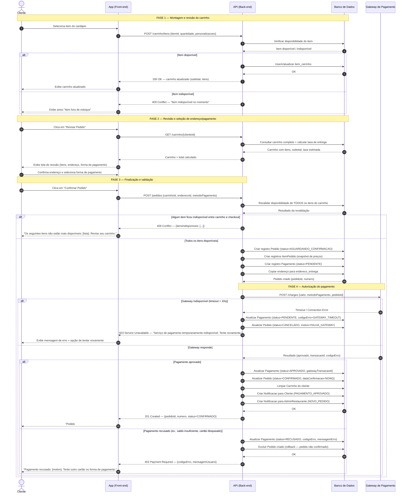

# Seção 3 — Modelagem Comportamental — Fatia 1

> **Trabalho 3 — FoodFlow | Modelagem de Software**  
> **Fatia 1:** Cliente realiza pedido e conclui pagamento  
> **Tipo de diagrama:** Diagrama de Sequência (UML)

---

## 3.1 Justificativa da Escolha do Tipo

Escolhemos o **Diagrama de Sequência** para a Fatia 1 porque o fluxo envolve **coordenação temporal precisa entre múltiplos componentes**: o cliente (ator humano), o front-end da aplicação, o back-end (API), e o gateway de pagamento externo (Stripe/Pagar.me). Cada componente age em resposta ao anterior e o tempo de resposta é crítico — especialmente na autorização do pagamento.

O diagrama de estados não seria adequado aqui: o objeto de interesse não é o ciclo de vida de uma entidade isolada, mas a **orquestração de uma transação distribuída**. O diagrama de atividades capturaria o fluxo, mas perderia a clareza sobre *quem* faz o quê e *quando*.

Os fragmentos `alt` são essenciais para expressar os três caminhos de erro principais: item esgotado no checkout, cartão recusado, e gateway indisponível.

---

## 3.2 Diagrama de Sequência — Fatia 1: Checkout com Pagamento

---

## 3.3 Descrição dos Participantes (Lifelines)

| Participante | Papel no Fluxo |
|---|---|
| **Cliente** | Ator humano que inicia o fluxo e recebe o resultado final |
| **App (Front-end)** | Interface mobile/web; coleta ações do usuário e exibe feedback |
| **API (Back-end)** | Orquestrador principal; valida, persiste e chama serviços externos |
| **Banco de Dados** | Repositório de estado persistente; nunca inicia comunicação |
| **Gateway de Pagamento** | Sistema externo (ex.: Stripe); autoriza ou recusa transações financeiras |

---

## 3.4 Fragmentos Utilizados e Sua Lógica

| Fragmento | Condição | Resultado |
|---|---|---|
| `alt` Item no carrinho | Disponível / Indisponível | Adiciona ao carrinho ou exibe aviso |
| `alt` Revalidação no checkout | Algum item esgotou / Todos ok | Bloqueia checkout ou prossegue |
| `alt` Gateway de pagamento | Timeout / Responde | Cancela pedido com mensagem técnica |
| `alt` Resultado do pagamento | Aprovado / Recusado | Confirma pedido ou faz rollback |

---

## 3.5 Invariantes Garantidas pelo Fluxo

1. **Nunca há pedido sem pagamento aprovado:** o status `CONFIRMADO` em `Pedido` só é atribuído após `status=APROVADO` em `Pagamento`.
2. **Preços são snapshots:** os `ItemPedido` são criados com os preços do momento do checkout. Alterações futuras no cardápio não afetam pedidos históricos.
3. **Carrinho só é limpo após confirmação:** se o pagamento falhar, o carrinho permanece intacto para nova tentativa.
4. **Rollback explícito em falha:** se o pagamento for recusado, o pedido provisório criado é excluído — não fica em estado `AGUARDANDO_CONFIRMACAO` indefinidamente.
