# Seção 3 — Modelagem Comportamental — Fatia 3

> **Trabalho 3 — FoodFlow | Modelagem de Software**  
> **Fatia 3:** Restaurante recebe pedido, gerencia preparo e aciona entrega  
> **Tipo de diagrama:** Diagrama de Atividades (UML Activity Diagram com Swimlanes)

---

## 3.1 Justificativa da Escolha do Tipo

Escolhemos o **Diagrama de Atividades com raias (swimlanes)** para a Fatia 3 porque o fluxo envolve **múltiplos atores e subsistemas agindo em paralelo ou em sequência**, com **decisões compostas** e **ações automáticas** do sistema que não requerem intervenção humana.

O diagrama de sequência seria válido, mas tende a ficar linear demais para fluxos com paralelismo real (ex.: notificar cliente e atualizar status ao mesmo tempo). O diagrama de estados seria inadequado porque o foco não é o ciclo de vida de uma entidade isolada, mas o **processo de trabalho distribuído** entre o Admin do Restaurante, o sistema (back-end), e o módulo de Logística. O diagrama de atividades com swimlanes torna visível **quem faz o quê** em cada etapa.

As raias são organizadas por ator/subsistema: `Admin do Restaurante`, `Sistema (API)`, `Cliente` e `Módulo de Logística`.

---

## 3.2 Diagrama de Atividades — Fatia 3: Restaurante Processa Pedido e Aciona Entrega

```mermaid
flowchart TD
    %% ── Estilo de swimlanes por cores ───────────────────────
    classDef restaurante fill:#fff3cd,stroke:#856404,color:#333
    classDef sistema fill:#d1ecf1,stroke:#0c5460,color:#333
    classDef cliente fill:#d4edda,stroke:#155724,color:#333
    classDef logistica fill:#f8d7da,stroke:#721c24,color:#333
    classDef decisao fill:#e2d9f3,stroke:#432874,color:#333
    classDef inicio_fim fill:#343a40,stroke:#000,color:#fff

    START([▶ Início\nPagamento aprovado no Pedido]):::inicio_fim

    %% ── SISTEMA: notifica restaurante ───────────────────────
    S1["📢 Sistema: Criar notificação\n'Novo Pedido #FFXXXX'\npara AdminRestaurante"]:::sistema
    S2["⏱️ Sistema: Iniciar timer\nde 2 minutos para aceite"]:::sistema

    %% ── ADMIN DO RESTAURANTE: decisão ───────────────────────
    R1["👤 Admin Restaurante:\nVisualiza detalhes do pedido\n(itens, endereço, observações)"]:::restaurante
    D1{{"⚡ Admin aceita\nou recusa?"}}:::decisao

    %% ── RAMO: RECUSA ─────────────────────────────────────────
    R_RECUSA["👤 Admin Restaurante:\nInforma motivo da recusa"]:::restaurante
    S_CANCEL["🔄 Sistema:\n• Atualizar Pedido → CANCELADO\n• Criar Pagamento.estorno()\n• Notificar Cliente: pedido recusado + motivo\n• Registrar log de auditoria"]:::sistema

    %% ── RAMO: TIMEOUT ────────────────────────────────────────
    D_TIMEOUT{{"⏱️ Timer de\n2 min expirou?"}}:::decisao
    S_TIMEOUT["🔄 Sistema (auto):\n• Cancelar pedido automaticamente\n• Iniciar estorno\n• Notificar cliente: 'restaurante não respondeu'\n• Penalizar restaurante no SLA"]:::sistema

    %% ── RAMO: ACEITE ─────────────────────────────────────────
    R_ACEITE["👤 Admin Restaurante:\nConfirma aceite do pedido"]:::restaurante
    S_CONFIRM["🔄 Sistema:\n• Atualizar Pedido → CONFIRMADO\n• Registrar data_confirmacao\n• Cancelar timer de aceite"]:::sistema

    %% ── PARALELO: notificações após confirmação ──────────────
    FORK1(["⫸ fork"]):::inicio_fim
    C_NOTIFY["📱 Sistema → Cliente:\nNotificação 'Pedido confirmado!\nEstimativa: X minutos'"]:::cliente
    S_LOG1["📋 Sistema:\nRegistrar evento de confirmação\nno log de auditoria"]:::sistema
    JOIN1(["⫸ join"]):::inicio_fim

    %% ── PREPARO ──────────────────────────────────────────────
    R_PREPARO["👤 Admin Restaurante:\nInicia preparo do pedido\n(clica em 'Em Preparo')"]:::restaurante
    S_PREPARO["🔄 Sistema:\n• Atualizar Pedido → EM_PREPARO\n• Registrar data_preparo_inicio"]:::sistema
    C_PREPARO["📱 Sistema → Cliente:\nNotificação 'Seu pedido está sendo preparado 🍳'"]:::cliente

    %% ── CÁLCULO DE TAXA E ACIONAMENTO DE ENTREGA ─────────────
    R_PRONTO["👤 Admin Restaurante:\nMarca pedido como pronto\n(clica em 'Pronto para Retirada')"]:::restaurante
    S_PRONTO["🔄 Sistema:\n• Atualizar Pedido → PRONTO_PARA_RETIRADA\n• Registrar data_pronto"]:::sistema

    S_CALC["🔄 Sistema:\nCalcular taxa de entrega:\n• Obter coordenadas: restaurante → cliente\n• Calcular distância (Google Maps API)\n• Verificar se é horário de pico\n• Aplicar tarifa dinâmica"]:::sistema
    D_PICO{{"⏰ Horário de pico?\n(11h-14h / 18h-21h)"}}:::decisao
    S_TAXA_PICO["🔄 Sistema:\nTaxa = distância × tarifa_pico\n(+20% sobre tarifa base)"]:::sistema
    S_TAXA_NORMAL["🔄 Sistema:\nTaxa = distância × tarifa_base"]:::sistema
    S_TAXA_JOIN(["⫸ join taxa"]):::inicio_fim

    %% ── ACIONAR LOGÍSTICA ────────────────────────────────────
    S_ENTREGA["🔄 Sistema:\nCriar registro Entrega:\n• status = AGUARDANDO_ACEITE\n• valor_entregador calculado\n• coordenadas origem/destino"]:::sistema

    FORK2(["⫸ fork"]):::inicio_fim
    LOG_BUSCA["🚴 Módulo Logística:\nBuscar entregadores disponíveis\npróximos ao restaurante\n(raio de 3km)"]:::logistica
    C_NOTIFY2["📱 Sistema → Cliente:\nNotificação 'Pedido pronto!\nBuscando entregador...'"]:::cliente
    JOIN2(["⫸ join"]):::inicio_fim

    LOG_OFERTA["🚴 Módulo Logística:\nEnviar oferta para\nentregador mais próximo"]:::logistica

    END_LOG(["▶ Fim desta fatia\n(continua no ciclo de vida\nda Entrega — Fatia 2)"]):::inicio_fim
    END_CANCEL(["✖ Fim\nPedido cancelado"]):::inicio_fim

    %% ── FLUXO PRINCIPAL ──────────────────────────────────────
    START --> S1
    S1 --> S2
    S2 --> R1
    R1 --> D_TIMEOUT

    D_TIMEOUT -->|"Não expirou"| D1
    D_TIMEOUT -->|"Sim — expirou"| S_TIMEOUT
    S_TIMEOUT --> END_CANCEL

    D1 -->|"Recusa"| R_RECUSA
    R_RECUSA --> S_CANCEL
    S_CANCEL --> END_CANCEL

    D1 -->|"Aceita"| R_ACEITE
    R_ACEITE --> S_CONFIRM
    S_CONFIRM --> FORK1

    FORK1 --> C_NOTIFY
    FORK1 --> S_LOG1
    C_NOTIFY --> JOIN1
    S_LOG1 --> JOIN1

    JOIN1 --> R_PREPARO
    R_PREPARO --> S_PREPARO
    S_PREPARO --> C_PREPARO
    C_PREPARO --> R_PRONTO

    R_PRONTO --> S_PRONTO
    S_PRONTO --> S_CALC
    S_CALC --> D_PICO

    D_PICO -->|"Sim"| S_TAXA_PICO
    D_PICO -->|"Não"| S_TAXA_NORMAL
    S_TAXA_PICO --> S_TAXA_JOIN
    S_TAXA_NORMAL --> S_TAXA_JOIN

    S_TAXA_JOIN --> S_ENTREGA
    S_ENTREGA --> FORK2

    FORK2 --> LOG_BUSCA
    FORK2 --> C_NOTIFY2
    LOG_BUSCA --> JOIN2
    C_NOTIFY2 --> JOIN2

    JOIN2 --> LOG_OFERTA
    LOG_OFERTA --> END_LOG
```

---

## 3.3 Legenda das Raias (Swimlanes)

| Cor | Ator / Subsistema | Papel no Fluxo |
|---|---|---|
| 🟡 Amarelo | **Admin do Restaurante** | Visualiza pedido, decide aceitar/recusar, atualiza status |
| 🔵 Azul | **Sistema (API Back-end)** | Orquestra transições, persiste dados, dispara notificações |
| 🟢 Verde | **Cliente** | Receptor passivo de notificações nesta fatia |
| 🔴 Vermelho | **Módulo de Logística** | Busca entregadores e gerencia ofertas de corrida |

---

## 3.4 Regras de Negócio Modeladas

### Regra 1: Timer de 2 minutos para aceite

O restaurante tem exatamente **2 minutos** para confirmar ou recusar um pedido após receber a notificação. Se não houver resposta:

- O pedido é cancelado automaticamente.
- O estorno é iniciado.
- O restaurante recebe penalidade no SLA (impacta sua visibilidade na plataforma).

**Justificativa:** clientes que esperaram por confirmação indefinidamente é um dos principais causadores de abandono de plataformas de delivery. O timeout garantido melhora a previsibilidade da experiência.

### Regra 2: Cálculo dinâmico da taxa de entrega

A taxa é calculada no momento em que o pedido é marcado como **pronto**, não no momento do checkout. Isso porque:

- A distância é calculada via API de mapas (Google Maps / OpenStreetMap) usando as coordenadas reais do restaurante e do endereço de entrega.
- A tarifa dinâmica aplica **+20%** sobre a tarifa base em **horários de pico** (almoço: 11h–14h; jantar: 18h–21h).
- O valor exibido no checkout é uma **estimativa**; o valor final é determinado aqui.

> **Nota:** se a taxa final calculada diferir em mais de R$ 2,00 da estimativa mostrada no checkout, o cliente é notificado antes de a entrega ser acionada, com opção de cancelar sem custo.

### Regra 3: Paralelismo em notificações

As notificações ao cliente e os registros de log são enviados **em paralelo** (representado pelos nós `fork/join`). Isso evita que a latência de uma operação adie a outra — o cliente recebe feedback imediato enquanto o log é gravado de forma assíncrona.

---

## 3.5 Pontos de Saída do Fluxo

| Saída | Condição | Próximo fluxo |
|---|---|---|
| **Pedido cancelado** | Restaurante recusa OU timer expira | Estorno via gateway; notificação ao cliente |
| **Entrega acionada** | Pedido pronto + entregador buscado | Ciclo de vida da Entrega (Fatia 2) |
