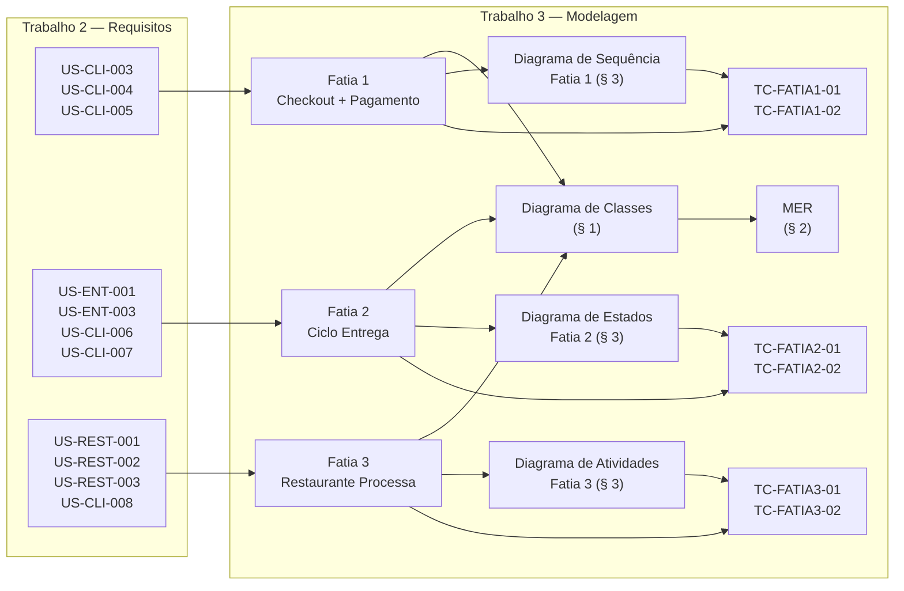

# Seção 5 — Rastreabilidade

> **Trabalho 3 — FoodFlow | Modelagem de Software**

---

## 5.1 Tabela de Rastreabilidade Principal

| Fatia | História(s) de Usuário (T2) | Classes Envolvidas (T3 § 1) | Entidades MER (T3 § 2) | Diagrama Comportamental (T3 § 3) | Casos de Teste (T3 § 4) |
|---|---|---|---|---|---|
| **Fatia 1** — Cliente realiza pedido e conclui pagamento | US-CLI-003, US-CLI-004, US-CLI-005 | `Cliente`, `Carrinho`, `ItemCarrinho`, `Pedido`, `ItemPedido`, `Pagamento`, `GatewayPagamento`, `ResultadoPagamento`, `Restaurante`, `Notificacao` | `usuario`, `carrinho`, `item_carrinho`, `pedido`, `item_pedido`, `endereco_entrega`, `pagamento`, `notificacao` | **Sequência** — [03-comportamental-fatia1.md](03-comportamental-fatia1.md) | TC-FATIA1-01, TC-FATIA1-02 |
| **Fatia 2** — Ciclo de vida da entrega | US-ENT-001, US-ENT-003, US-CLI-006, US-CLI-007 | `Entrega`, `StatusEntrega`, `Entregador`, `Cliente`, `Avaliacao`, `Notificacao`, `Coordenada` | `entrega`, `usuario` (entregador), `avaliacao`, `notificacao` | **Estados** — [03-comportamental-fatia2.md](03-comportamental-fatia2.md) | TC-FATIA2-01, TC-FATIA2-02 |
| **Fatia 3** — Restaurante processa pedido e aciona entrega | US-REST-001, US-REST-002, US-REST-003, US-CLI-008 | `AdminRestaurante`, `Restaurante`, `Pedido`, `StatusPedido`, `Entrega`, `Notificacao`, `Endereco`, `Coordenada` | `usuario` (admin), `restaurante`, `pedido`, `entrega`, `notificacao`, `horario_funcionamento` | **Atividades** — [03-comportamental-fatia3.md](03-comportamental-fatia3.md) | TC-FATIA3-01, TC-FATIA3-02 |

---

## 5.2 Cobertura dos Critérios de Seleção

| Critério Obrigatório | Fatia que Atende | Como Atende |
|---|---|---|
| **Must Have do MoSCoW** | Fatia 1 e Fatia 2 | Checkout + entrega são o núcleo sem o qual o FoodFlow não opera como produto |
| **Múltiplos subsistemas / tipos de usuário** | Fatia 1 (3 subsistemas + gateway), Fatia 2 (3 atores distintos), Fatia 3 (2 atores + sistema automático) | Todos os três atores principais interagem ao longo das fatias |
| **Regras de negócio não-triviais** | Fatia 2 (timeouts + estados compostos), Fatia 3 (cálculo dinâmico de taxa + timer de aceite) | Fatia 1 também tem regras de erro; Fatia 3 tem a maior concentração de regras de domínio |

---

## 5.3 Mapa de Conexões entre Artefatos

---

## 5.4 Classes por Subsistema

| Subsistema | Classes do Diagrama |
|---|---|
| **Catálogo & Pedidos** | `Restaurante`, `ItemCardapio`, `Personalizacao`, `Carrinho`, `ItemCarrinho`, `Pedido`, `ItemPedido`, `StatusPedido` |
| **Pagamentos** | `Pagamento`, `StatusPagamento`, `MetodoPagamento`, `GatewayPagamento`, `GatewayStripe`, `ResultadoPagamento` |
| **Logística & Rastreamento** | `Entrega`, `StatusEntrega`, `Entregador`, `Avaliacao`, `Coordenada` |
| **Usuários & Notificações** | `Usuario`, `Cliente`, `AdminRestaurante`, `Notificacao`, `TipoNotificacao`, `Endereco` |

---

## 5.5 Histórias do Trabalho 2 Não Modeladas Neste Trabalho

| Funcionalidade | Histórias (estimadas) | Motivo da Exclusão |
|---|---|---|
| Cadastro e autenticação | US-AUTH-001, US-AUTH-002 | Fluxo padrão sem regra de domínio específica |
| Busca e filtros de restaurante | US-CLI-001, US-CLI-002 | CRUD de consulta; sem estados complexos |
| Gerenciamento de cardápio | US-REST-004 a US-REST-007 | CRUD; não agrega nova dimensão de modelagem |
| Histórico de pedidos | US-CLI-010, US-CLI-011 | Consulta de dados já persistidos |
| Painel administrativo da plataforma | US-ADM-001 a US-ADM-005 | Conjunto operacional de CRUD |
| Avaliação do restaurante | US-CLI-009 | Padrão idêntico à avaliação do entregador (Fatia 2) — modelar seria redundante |
| Relatórios e analytics | US-ADM-006, US-ADM-007 | Fora do escopo de modelagem de domínio; depende de decisões de BI |

---

## 5.6 Cobertura de Tipos de Diagrama

| Tipo de Diagrama Comportamental | Fatia Coberta | Seção |
|---|---|---|
| **Diagrama de Sequência** ✅ | Fatia 1 (Checkout + Pagamento) | [§ 3.1](03-comportamental-fatia1.md) |
| **Diagrama de Estados** ✅ | Fatia 2 (Ciclo de Vida da Entrega) | [§ 3.2](03-comportamental-fatia2.md) |
| **Diagrama de Atividades** ✅ | Fatia 3 (Restaurante Processa Pedido) | [§ 3.3](03-comportamental-fatia3.md) |

> **Nota:** O trabalho exige **pelo menos 2 dos 3 tipos**. O grupo optou por usar os **3 tipos** — cada um aplicado à fatia para a qual é mais adequado, demonstrando escolha consciente de ferramenta de modelagem em vez de aplicação mecânica.
